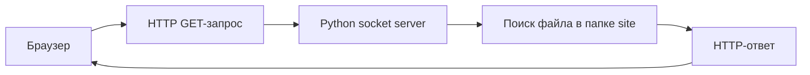
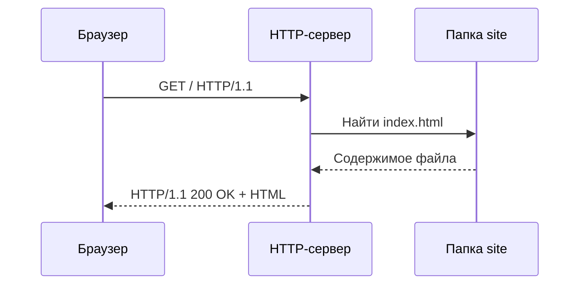
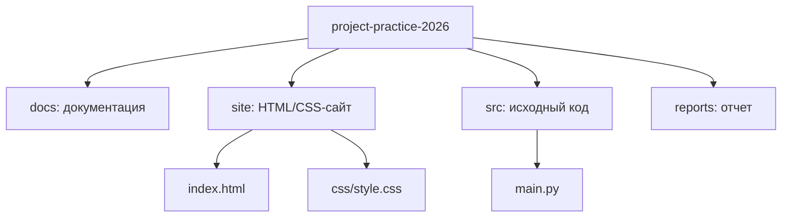

# Практическая реализация HTTP-сервера

## Введение

HTTP-сервер - это программа, которая принимает запросы от клиента, обрабатывает их и возвращает ответ. В роли клиента обычно выступает браузер.

В рамках вариативной части был реализован простой HTTP-сервер на Python без использования готовых веб-фреймворков.

## Что изучалось

- структура HTTP-запроса;
- структура HTTP-ответа;
- работа TCP-сокетов;
- обработка GET-запросов;
- отдача HTML и CSS файлов;
- базовая обработка ошибок.

## Архитектура



## Алгоритм работы сервера

1. Сервер запускается на `127.0.0.1:8080`.
2. Ожидает подключение клиента.
3. Получает HTTP-запрос.
4. Из первой строки запроса определяет путь к файлу.
5. Возвращает найденный файл или ошибку `404 Not Found`.



## Структура файлов



## Пошаговое руководство

1. Создать TCP-сокет с помощью стандартного модуля `socket`.
2. Привязать сервер к адресу `127.0.0.1` и порту `8080`.
3. Перевести сокет в режим ожидания подключений.
4. Получить HTTP-запрос от браузера.
5. Разобрать первую строку запроса и определить путь к файлу.
6. Найти файл в папке `site`.
7. Сформировать HTTP-ответ со статусом, заголовками и телом ответа.
8. Отправить ответ клиенту и закрыть соединение.

## Пример кода

```python
with socket.socket(socket.AF_INET, socket.SOCK_STREAM) as server_socket:
    server_socket.bind(("127.0.0.1", 8080))
    server_socket.listen()
    client_socket, address = server_socket.accept()
```

## Модификация

В учебную реализацию добавлена отдача статических файлов из папки `site`. Это позволяет использовать сервер не только для текстового ответа, но и для показа полноценной HTML-страницы со стилями.

## Вывод

В результате работы были изучены базовые принципы клиент-серверного взаимодействия и создана минимальная реализация HTTP-сервера на Python.
