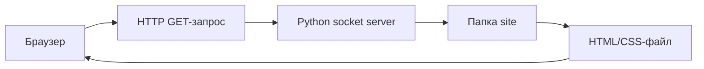
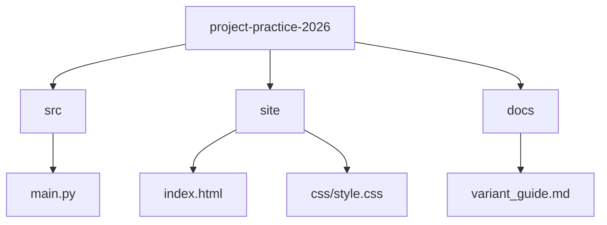

# Вариативная часть: базовый HTTP-сервер на Python

## 1. Выбранный вариант

Для части по выбору был выбран вариант **2.2. Практическая реализация технологии «с нуля»**.

Тема работы:

```text
Python : Building a basic HTTP Server from scratch in Python
```

Тема выбрана по подборке [codecrafters-io/build-your-own-x](https://github.com/codecrafters-io/build-your-own-x), разделу про создание собственного веб-сервера.

## 2. Цель работы

Цель вариативной части - изучить базовый принцип работы HTTP-сервера и реализовать минимальный рабочий прототип на Python без использования готовых веб-фреймворков.

## 3. Исследование технологии

HTTP-сервер - это программа, которая принимает запросы от клиента, обрабатывает их и возвращает ответ. В роли клиента чаще всего выступает браузер.

При открытии страницы браузер отправляет HTTP-запрос. В запросе содержится метод, путь к ресурсу, версия протокола и заголовки. Сервер анализирует запрос, определяет нужный файл или действие и возвращает HTTP-ответ.

Пример первой строки HTTP-запроса:

```http
GET /index.html HTTP/1.1
```

Пример первой строки HTTP-ответа:

```http
HTTP/1.1 200 OK
```

Для реализации учебного сервера использовался модуль `socket` из стандартной библиотеки Python. Он позволяет работать с TCP-соединениями напрямую.

## 4. Аналоги и отличие от учебной реализации

В реальных проектах обычно используются готовые веб-серверы и фреймворки:

- Nginx;
- Apache HTTP Server;
- Flask;
- Django;
- FastAPI.

В рамках практики готовый фреймворк не использовался. Это сделано специально, чтобы изучить базовую механику: получение запроса, формирование заголовков и отправку ответа.

## 5. Архитектура прототипа



Сервер работает локально по адресу:

```text
127.0.0.1:8080
```

Статические файлы берутся из папки:

```text
site/
```

## 6. Структура файлов



Основные файлы:

- `src/main.py` - исходный код HTTP-сервера;
- `site/index.html` - главная HTML-страница;
- `site/css/style.css` - стили сайта;
- `docs/variant_guide.md` - описание вариативной части.

## 7. Алгоритм работы

```text
Пользователь
     |
     v
Браузер отправляет GET-запрос
     |
     v
src/main.py принимает запрос
     |
     v
Сервер ищет файл в папке site
     |
     +-- файл найден ----> 200 OK
     |                     |
     |                     v
     |                 браузер показывает страницу
     |
     +-- файл не найден -> 404 Not Found
```

Пояснение к схеме:

1. Пользователь открывает страницу в браузере.
2. Браузер отправляет HTTP GET-запрос.
3. Сервер `src/main.py` принимает запрос через `socket`.
4. Сервер определяет путь к файлу в папке `site`.
5. Если файл найден, сервер читает его и возвращает `HTTP 200 OK`.
6. Если файл не найден, сервер возвращает `HTTP 404 Not Found`.

Пошагово:

1. Сервер создаёт TCP-сокет.
2. Сокет привязывается к адресу `127.0.0.1` и порту `8080`.
3. Сервер ожидает подключение клиента.
4. Браузер отправляет HTTP-запрос.
5. Сервер читает первую строку запроса.
6. Если метод запроса `GET`, сервер определяет путь к файлу.
7. Сервер ищет файл в папке `site`.
8. Если файл найден, возвращается ответ `200 OK`.
9. Если файл не найден, возвращается ответ `404 Not Found`.

## 8. Фрагменты кода

Создание и запуск сокета:

```python
with socket.socket(socket.AF_INET, socket.SOCK_STREAM) as server_socket:
    server_socket.setsockopt(socket.SOL_SOCKET, socket.SO_REUSEADDR, 1)
    server_socket.bind((HOST, PORT))
    server_socket.listen()
```

Формирование HTTP-ответа:

```python
def build_response(status: str, body: bytes, content_type: str) -> bytes:
    headers = [
        f"HTTP/1.1 {status}",
        f"Content-Length: {len(body)}",
        f"Content-Type: {content_type}",
        "Connection: close",
        "",
        "",
    ]
    return "\r\n".join(headers).encode("utf-8") + body
```

Обработка GET-запроса:

```python
first_line = request.splitlines()[0] if request else ""
parts = first_line.split()

if len(parts) < 2 or parts[0] != "GET":
    body = b"<h1>400 Bad Request</h1>"
    client_socket.sendall(build_response("400 Bad Request", body))
    return
```

## 9. Модификация

Базовая идея HTTP-сервера была расширена. В учебную реализацию добавлены:

- отдача статических файлов из папки `site`;
- определение MIME-типа по расширению файла;
- поддержка HTML, CSS, PNG, JPG, JPEG и SVG;
- защита от выхода за пределы папки `site`;
- обработка ошибки `404 Not Found`;
- обработка некорректного запроса через `400 Bad Request`.

Благодаря этому сервер может показывать не только один текстовый ответ, а полноценную HTML-страницу со стилями.

## 10. Запуск

Команда запуска:

```bash
python src/main.py
```

После запуска в браузере нужно открыть:

```text
http://127.0.0.1:8080
```

## 11. Проверка работоспособности

Работоспособность проверялась локально:

- сервер запускается без ошибок;
- главная страница открывается в браузере;
- HTML-файл отдаётся с кодом `200 OK`;
- CSS-файл подключается к странице;
- отсутствующий файл возвращает `404 Not Found`.

## 12. Хронология выполнения

1. Выбрана тема вариативной части.
2. Изучены основы HTTP-запросов и ответов.
3. Подготовлен минимальный TCP-сервер на Python.
4. Добавлена обработка GET-запросов.
5. Реализована отдача файлов из папки `site`.
6. Добавлена базовая обработка ошибок.
7. Подготовлена документация и схема работы.

## 13. Вывод

В результате вариативной части был создан минимальный жизнеспособный HTTP-сервер на Python. Работа помогла понять, как браузер отправляет запрос, как сервер его принимает и как формируется HTTP-ответ.

Реализация не заменяет полноценные веб-фреймворки, но показывает базовый принцип клиент-серверного взаимодействия и устройство простого веб-сервера.

## 14. Использованные материалы

- [Build Your Own X](https://github.com/codecrafters-io/build-your-own-x)
- [Python socket documentation](https://docs.python.org/3/library/socket.html)
- [MDN Web Docs: HTTP](https://developer.mozilla.org/ru/docs/Web/HTTP)
- [Writing an HTTP server from scratch](https://bhch.github.io/posts/2017/11/writing-an-http-server-from-scratch/)
